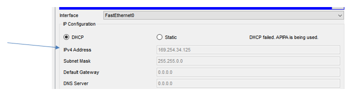
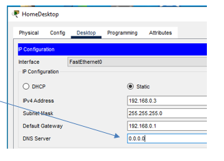

## Exercice 1 - Depannage DHCP

### Objectif : 

- Dépanner un servce DHCP de réseaux locaux.

## Étape 1 : Configuration des enregistrements sur le serveur 

- Démarrez l'application  ```./Exercices/10.2.2.8 Packet Tracer - DNS and DHCP_SLN.pka``` sur votre poste de travail, si cela n'est pas encore fait.

- Si vous désactivez le service DHCP du routeur sans fil WRS, les postes recevront une erreur d'attribution.

<details>
    <summary>Erreur DHCP</summary>



</details>

- Lorsque la requête DHCP est en échec, le système d'exploitation Windows retourne une adresse APIPA du réseau 169.254.X.X /16.

## Étape 2 :  Dépannage d'attribution d'adresses IP.

- Erreur de configuration statique d'un poste. La résolution de domaine DNS est en échec.

<details>
    <summary>Erreur de configuration statique</summary>



</details>

- résolution de problèmes d'attribution d'adresses IP.

    1. utilisez la commande ```ipconfig /all```  ( l'option /All est importante)

    2. Pour les réseaux sans fils, vérifiez l'accès (mot de passe) au routeur sans fil.

    3. pour les réseaux filés, vérifiez le câblage Ethernet entre le PC et le routeur.

    4. Testez votre routeur avec un autre poste.

    5. Si le poste reçoit une adresse APIPA, contactez le soutien technique de l'entreprise ou de votre FAI.

## Étape 4 :  Questions de compréhension.

1. Quelle adresse IP a été attribué au LapTop?_______ Quelle adresse IP est attribuées à sa passerelle par défaut?______

2. Quelle adresse IP a été attribué à la tablette?_______ Expliquez pourquoi la tablette a reçu cette adresse IP. ____________________________

3. Quelle sera la conséquence pour un utilisateur si la configuration d'un poste ne contient pas d'adresse IP pour le DNS? ____________________________


## Étape 5 :  Fin de l'exercice.

- Sauvegardez votre fichier pka.
