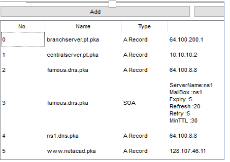
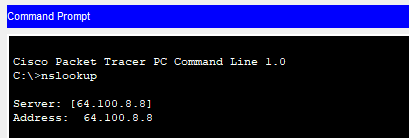
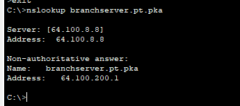

## Exercice 2 - Depannage DNS 

### Objectif : 

- Dépanner un servce DNS.

- Démarrez l'application  ```./Exercices/10.2.2.8 Packet Tracer - DNS and DHCP_SLN.pka``` sur votre poste de travail, si cela n'est pas encore fait.

- L'activité  PT est contenue dans le fichier .pka. 

### Partie 1 :  DNS sur un poste local
## Étape 1 :   Vérifier la configuration du service DNS.

- Vous devez corriger la configuration du service DNS de Famous.dns.pka si non conforme à cette image.

<details>
    <summary>Configuration DNS</summary>



</details>

1. Ouvrez l'application Web Browser de Laptop.

2. Sur le poste ou la tablette, affichez la page web principale de  ```branchser.pt.pka ``` http://```.

2. Sur le poste ou la tablette, affichez la page web principale de de  ```branchser.pt.pka ``` avec le préfixe ```www```. La requête échoue. Expliquez Pourquoi__________________

## Étape 2 :   synonymes de serveur DNS.

 1. Ajoutez une une inscription française au serveur branchserver.pt.pka. La référence est: ```www.succursale.pt.pka```. Testez votre nouvelle inscription.

## Étape 3 :   Dépannage du service DNS.

1. Utilisez la commande ```nslookup``` pour vérifier le service DNS.

<details>
    <summary>Configuration DNS</summary>



</details>

2. Utilisez la commande nslookup pour vérifier la résolution DNS de branchserver et de CentralServer.

<details>
    <summary>Configuration DNS</summary>



</details>
