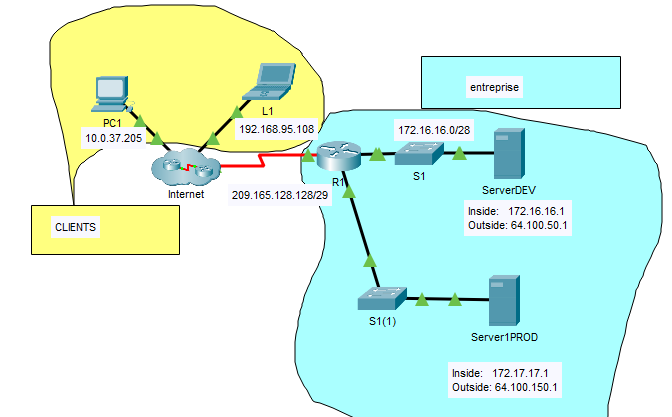

## Exercice 3 - DepannageNAT

### Objectif : 

- Configurer une traduction NAT.

- Dépanner une traduciton NAT.

## Étape 1 : Vérification de la traduction NAT 

- Démarrez l'application  ```./Exercices/Configuration_Static_NAT.pka``` sur votre poste de travail, si cela n'est pas encore fait.

1.  Utilisez le bouton Check Results pour vous assurer que la configuration est complèete.

2. Sur le routeur d'entreprise R1, vérifiez les traductions NAT précédentes. La commande est ``` R1# show ip nat translations```. Les clients PC1 et Laptop n'ont pas encore fait de requêtes vers l'entreprise. Comment pouvez affirmer cela?____________

3.  Sur PC1, lancez une recherche Web ver le serveur de développement ServerDEV. Devez-vous utiliser l'adresse 172.16.16.1 ou 64.10.50.1? Justifiez votre réponse?__________________________  La requête doit réussis.

4. Sur le routeur d'entreprise R1, vérifiez les nouvelles traductions NAT. Comment pouvez affirmer cela?____________.

 5.  Sur PC1, lancez une recherche Web ver le serveur de production ServerPROD. Devez-vous utiliser l'adresse 172.17.17.1 ou 64.10.150.1? Justifiez votre réponse?__________________________  La requête doit échouée.

 
## Étape 2 :   Configuration d'une traduction NAT.

- Pour parvenir à rejoindre le serveur serverPROD, le routeur R1 doit être configuré pour une nouvelle traduction NAT.

1. Sur R1, ajoutez la propriété  ```ip nat inside ``` à l'interface gigaEthernet gi0/1.

2. Sur R1, ajoutez une traduction NAT entre l'adresse IP du serveur local  ```ServerPROD ``` et l'adresse globale attribué ``64.100.150.1``

3. Dépannez le serveur ServerPROD pour obtenir une connectivité avec PC1 et L1.

<details>
    <summary>Configuration DNS</summary>



</details>

## Étape 3 : Dépannaage d'une traduction NAT.

-  La commande est ``` R1# show ip nat translations``` permet d'observer les paquets qui sont traduits entre le réseau local et le réseau WAN.

1. Sur R1, utilisez la commande show pour déterminer les paquets qui ont circulés entre le serveur serverPROD et PC1.

2. Sur La, effectuez une recherche web sur le serveur serverPROD. Vérifiez la traduction NAT à nouveau.

## Étape 4 : Sauvegarde de votre travail.
