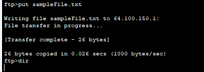

## Exercice 4 - Transfert de fichiers en mode commande 

### Objectif : 

- transférer des fichiers entre deux environnements web.

- Démarrez l'application  ```./Exercices/Configuration_Static_NAT.pka``` sur votre poste de travail, si cela n'est pas encore fait.

- L'activité  PT est contenue dans le fichier .pka. 

- L'activité  Module15_3_DepannageNAT.md réussie est préalable à cette activité. 

## Étape 1 : Vérification de la traduction NAT 

Dans cet exercice, vous allez tranférer un fichier index.html de developpement (serverDEV) vers un environnement de production (serverPROD).
1. Utilisez le bouton Check Results pour vous assurer que la configuration est complèete.

2.  Ouvrez une fenêtre CommandPrompt sur ServerDEV. Lancez la commande pour obtenir la liste des fichiers disponibles (sur PT, le répertoire courant est toujours C:\). Mémorisez le nom du fichier.

3.  Ouvrez une fenêtre CommandPrompt sur PC1. Lancez la commande de transfert ftp suivante: ```ftp 64.100.50.1 ```. Le compte ftp est ```cisco```; le mot de passe est ```cisco```! Le message 230- Logged in en mode passif s'affiche, sinon recommencez l'étape 2.

4. Lancez le transfert de fichier du PC vers le serveur.

<details>
    <summary>transfert FTP</summary>



</details>

5. VÉrifiez le transfert par la commande <Dir>.

