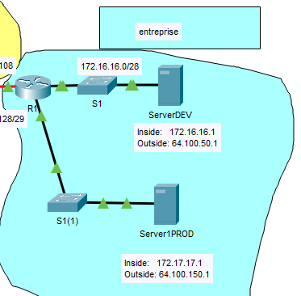
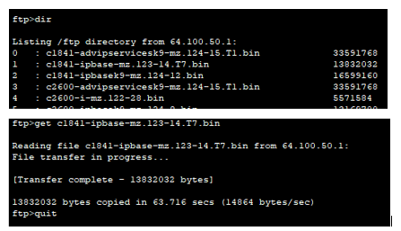

## Exercice 4 - Transfert de fichiers en mode commande 

### Objectif : 

- Migration de fichiers entre deux serveurs.

- Démarrez l'application  ```./Exercices/Configuration_Static_NAT.pka``` sur votre poste de travail, si cela n'est pas encore fait.

- L'activité PT est contenue dans le fichier .pka. 

- L'activité Module15_3_DepannageNAT.md réussie est préalable à cette activité. 

## Étape 1 : Migration de fichiers avec le protocole ftp 

Dans cet exercice, vous allez tranférer un fichier d'un environnement de développement (serverDEV) vers un environnement de production (serverPROD). Cette simulation vise à démontrer un processus de migration d'une application entre environnements.

<details>
    <summary>Migration d'application par FTP</summary>



</details>

1. Utilisez le bouton Check Results pour vous assurer que la configuration du fichier PT est complèete.

2.  Ouvrez une fenêtre CommandPrompt sur PC1. 
Lancez la commande de transfert ftp suivante: ```ftp 64.100.50.1```. Répondre ```cisco``` à l'authentification. Répondre aussi ```cisco``` pour le mot de passe. Le message ```230- Logged in``` s'affiche, sinon recommencez l'étape 2.

3. Lancez la commande ```dir``` pour afficher tous les fichiers du serveur serverDEV. 

<details>
    <summary>transfert FTP</summary>



</details>

4. Lancez la commande ```get``` pour débuter le transfert d'un fichier binaire vers le PC. 

5. Fermez la connexion ftp du serveur serverDEV par la commande quit.

5. VÉrifiez que le transfert a fonctionné sur le PC.
 
6. Procédez au transfert du fichier vers l'environnement serverPROD avec la commande ftp  ```put```. Inspirez-vous des étapes précédements pour vous aider.
## Étape  2 : Dépannaage d'une connexion FTP.

1. Sur le routeur R1, lancez la command  ```show ip nat translations```. Vous devriez observer des connexions FTP  associés au port 21 du protocole TCP.

## Étape  3 : Sauvegarde de votre travail.