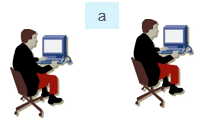
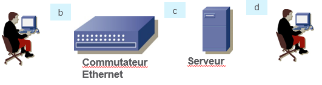
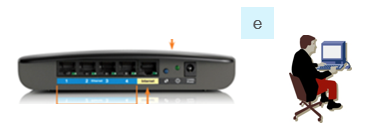

# Module 02 - Medias de transmission

Objectifs :

- Brancher les câbles convenant aux divers équipements pour assurer la transmission des signaux entre périphériques

- Expliquer la raison d'avoir des câbles Ethernet droits et croisés

- Déterminer l'adresse IP d'une carte réseau Ethernet

- Déterminer l'adresse IP d'une interface Ethernet d'un routeur

## Lectures obligatoires

- Se connecter sur le site web NetaCad(c)

- Rendez-vous au  chapitre 4: Couche physique
- Lire ET résumer les lectures suivantes:

    4.0.2; 4.2.3; 4.2.5; 4.2.6; 4.2.7;

    4.3.2; 4.3.3; 4.3.4; 4.3.5; 4.3.6; 4.4.3.

    les autres rubriques sont optionnelles

## Exercice 1 -  codage d'un message

Dans cet exercice, vous allez coder un  message   dans les trois formats de nombres: décimal, exxadécimal et binaire. Vous utuliserez le système des caractères ASCII.

<details>
    <summary>Indice</summary>

consultez le site web de Wikipedia pour le tableau des caractères. 

</details>

### Étape 1 - Quels sont les nombres décimaux qui représentent le message dans le système ASCII standard:  ```Allo le monde```

### Étape 2 - Convertir ces nombres en format hexadécimal?

### Étape 3 - Convertir ces nombres en format binaire.

Le fichier MessageCodeEnBinaire.xls du site GitHub vous facilitera la disposition des "0" et des "1". 

## Exercice 2 - temps de transmission

- Votre carte réseau sans fil est calibrée à 2 Mbits/seconde. Combien de temps faut-il pour transmettre le message suivant: ```Allo mes amis de qui je ne recois plus de messages```?

<details>
    <summary>Précisions</summary>

Votre calcul ne tient pas compte de facteurs modifiant la transmissions. 

</details>

## Exercice 3 - Câblage UTP
Dans cet exercice, vous allez choisir le câble approprié pour brancher les équipements entre eux

### Étape 1 - connexion dos-à-dos

Choisir le câble Ethener approprié pour racorder les deux PCs entre eux. 

 

### Étape 2 - réseau local
Choisir le câble Ethener approprié pour racorder les équipements du réseau local suivant. 



### Étape 3 - Réseau domestique
Choisir le câble Ethener approprié pour racorder le PC au routeur domestique. 



## Exercice 5 -  réseauEthernetDomestique
Suivre les instructions du fichier  ```4.6.6 LaboReseauEthernetFileEtSansFil.pdf``` et répondre aux questions dans votre cahier de note.

Certaines questions peuvent vous sembler inconnues. Ne pas s'en faire. Répondez au meilleur de votre connaissance. Elles seront expliquées dans les prochains modules.

<details>
    <summary>Reseau Filaire ou SansFil</summary>

l'étape 2 concerne les cartes de réseau sansFil. répondez aux questions, sinon sautez cette étape.

l'étape 2 concerne les cartes de réseau filaire. répondez aux questions, sinon sautez cette étape ou utilisez un appareil équipé d'une carte réseau Eternet filé (câblage RJ-45).

</details>

## Exercice 6 - réseau d'entreprise
Dans cet exercices, vous utiliserez le simulateur Packet Tracer. Le fichier  fichier ```4.6.5CablageEthernetEtSansFil.zip``` contient deux fichiers
    :une applicaiton de type "PacketTracer"
    : les instructions pour cet exercice.

- Décompressez le fichier dans un répertoire de votre poste de travail.

<details>
    <summary>Recommendations</summary>

Regroupez tous vos exercices du cours 420-W33-SF dans un même sous-répertoire de votre poste personnel. Vous pourrez y revenir plus facilement dans le futur.

</details>

- Exécutez l'application PT en vous aidant des  instructions contenues dans le fichier 

FIn des exercices du module 
