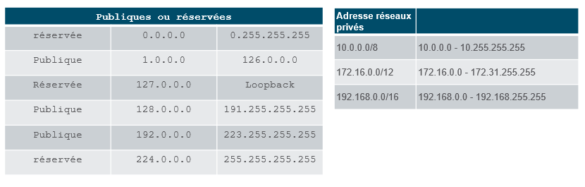
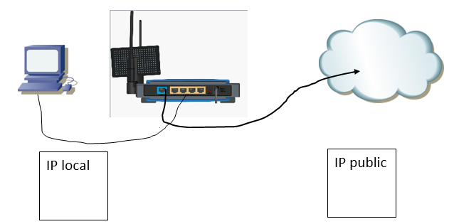

## Exercice 2 - Adresses publique et privée

### Étape 1 - Configuration du poste

-  Sur votre ordinateur, ouvrez une fenêtre ```invite de commandes```. 

- Entrez la commande pour obtenir la configuration de votre poste sur le réseau local
-   quelle est l'adresse de votre poste ?
-   quel est le masque de sous-réseau?
-   quelle est l'adresse de la passerelle par défaut?

- Validez ces réponses à partir du panneau de configuration.

<details>
    <summary>Indice</summary>
- Consultez la présentation du module  pour vous aider.

</details>


- Cette adresse est-elle une adresse publique? Expliquez

### Étape 3 - Adresse IP publique
Pour cette étape, votre poste doit être relié à internet

- Ouvrez votre navigateur web.
- Entrez la recherche suivante: ```https://ifconfig.io```.

-  Quelle est l'adresse IP qui est affichée?

- Cette adresse est-elle une adresse publique? Expliquez

<details>
    <summary>Indice</summary>



</details>

### Étape 4 - Adresse IP publique (optionnel)

L'utilitaire ```curl``` peut vous fournir les mêmes informations

-  Sur votre ordinateur, ouvrez une fenêtre ```invite de commandes```. 

- Entrez la commande ```curl ifconfig.io```

<details>
    <summary>Autres options</summary>

```curl ifconfig.io/country_code```

```curl ifconfig.io/port```

```curl ifconfig.io/all```

</details>

### Étape 4 - Schéma d'adresses IP

- Reproduire le schéma suivant à l'aide du logiciel de représentation graphique.

- remplacez les cases IP local et IP plublic par les valeurs obtenues dans les étapes précédentes.



